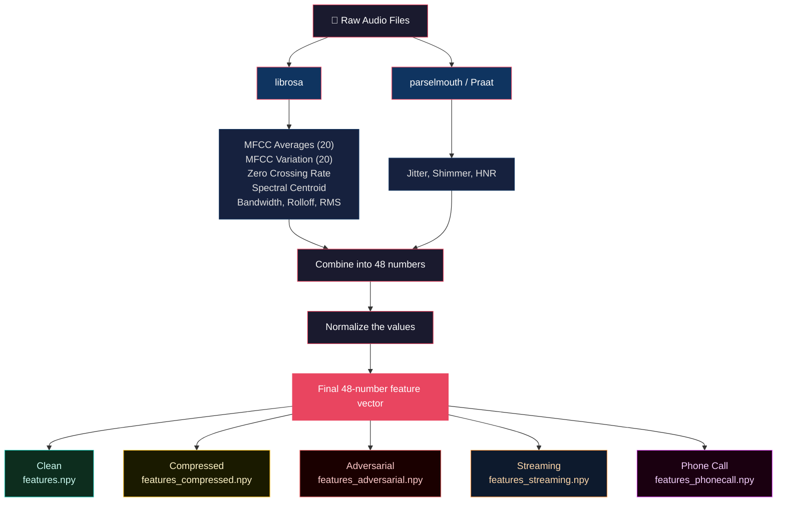

# 🎙️ Voice Authenticity Detection

## What Is This?

Fake voices are a huge problem. Tools like ElevenLabs can copy anyone's voice in under a minute. Scammers use these cloned voices to steal money, trick people over the phone, and spread false information. This cost the world over $25 billion in 2024 alone.

This project is a training ground for AI agents that learn to tell the difference between **real human voices** and **AI-generated fake voices**.

But here is the key part: the agent does not just get all the data at once and make a guess. Instead, it has to **investigate step by step**, like a detective. It starts with zero information and has to decide what clues to look for, put them together, and then make a judgment call.

## How Does the Agent Work?

The agent follows a simple investigation process. Think of it like a detective solving a case:

| Step | What the Agent Does | What It Gets Back | Why This Helps |
|------|-------------------|------------------|---------------|
| 1 | Ask for voice stability clues | Jitter, shimmer, HNR (how shaky or smooth the voice is) | Real voices have natural wobbles. Fake voices are too perfect. |
| 2 | Ask for sound shape clues | 20 MFCC values, zero crossing rate, spectral centroid | These describe the "texture" and "color" of the voice. |
| 3 | Compare to known examples | How similar this voice is to known real and fake voices | Like comparing a signature to ones you have on file. |
| 4 | Think about all the clues | A summary of everything gathered so far, with a recommendation | The agent puts the puzzle together before deciding. |
| 5 | Make a final decision | Submits: real or fake, how confident it is, and why | This is where the agent gets scored. |

The agent starts with **nothing visible**. It has to earn its information before it can decide. This is what makes it different from a regular classifier that sees everything at once.

---

## 🚫 Why Other Tests Fall Short

Other voice detection tests (like ASVspoof and ADD) work like this: give the AI all the data, let it make one guess, and check if it is right or wrong. That is it.

That approach cannot test:
- Whether the AI knows **which clues to look for**
- Whether the AI can **put different types of evidence together**
- Whether the AI is **honest about how confident it is** (saying "I'm not sure" when it really is not sure)
- Whether the AI can handle **messy real-world audio** like phone calls and streaming

This environment tests all of those things.

---

## 🌍 Why This Matters in the Real World

AI-generated voices are being used for:

- **Phone scams**: cloning someone's voice during a live call
- **Fake audio clips**: putting false words in a public figure's mouth
- **Identity theft**: tricking voice-based security systems (like bank phone lines)
- **CEO fraud**: cloning a boss's voice to trick employees into sending money
- **Insurance fraud**: creating fake recorded statements

This project gives AI agents a way to practice catching these fakes under realistic conditions.

---

## 🏗️ How the Environment Works

The environment gives the agent a set of 48 numbers (features) extracted from an audio clip. But the agent cannot see them right away. It has to request them step by step, building up its picture before making a decision.

This creates a real decision-making challenge where the agent must:
- Choose what information to ask for and in what order
- Combine different types of clues
- Be honest about how certain (or uncertain) it is
- Follow a logical investigation path

---

## 🏆 The 6 Tasks

There are 6 tasks, each getting harder. The first five tasks test whether an agent can read a signal correctly. The sixth tests whether it knows when it has read enough. The harder tasks usually have messier audio, which makes fake voices harder to detect.

| Task | How Hard | Expected Score | What Makes It Different |
|------|----------|---------------|----------------------|
| `clean_detection` | Easy | 0.65 to 0.78 | Clean, clear audio. The clues are easy to spot. |
| `compressed_detection` | Medium | 0.50 to 0.65 | Audio has been compressed (like an MP3). Some details get lost. |
| `adversarial_detection` | Hard | 0.40 to 0.58 | The fake voices have been tweaked to look more like real ones. Very tricky. |
| `streaming_detection` | Medium-Hard | 0.38 to 0.55 | Early clues are noisy and unreliable. Later clues get cleaner. |
| `phonecall_detection` | Extreme | 0.25 to 0.42 | Simulates a real phone call with bad audio quality and background noise. |
| `realtime_detection` | Realtime | 0.50 to 0.68 | The agent can decide early, but every extra step costs points. Tests speed vs accuracy. |

### Why Harder Tasks Get Lower Scores

This is on purpose. Harder tasks have genuinely worse audio quality, which means even a perfect agent will score lower. The scoring system accounts for this, so a score of 0.35 on the phone call task might actually be impressive, while 0.60 on the clean task would be average.

### The Realtime Detection Task (New!)

This task changes the rules. Instead of following a fixed 5-step sequence, the agent can make its final decision **at any point after step 2**.

But there is a catch: **every extra step costs 0.03 points** off the final score.

Here is how it works:
- The agent MUST take at least 2 steps to gather evidence (steps 1 and 2)
- After that, the agent can classify whenever it wants
- Step 3 costs 0.03, step 4 costs 0.06, step 5 costs 0.09, and so on
- A smart agent will classify as soon as it feels confident enough, instead of always going through every single step

This tests a completely different skill: **knowing when to stop investigating**. Some agents will jump to conclusions too early and get the wrong answer. Others will keep gathering evidence they do not need and lose points to the time penalty. The best agents find the sweet spot.

This task is not harder because the audio is bad. It uses the same clean audio data as the easy task. The challenge is purely about decision timing and choosing the right moment to stop. No extra data or computing power is needed.

---

## 🏅 How Scoring Works (6 Parts)

Every episode is scored across 6 different areas. The weight of each area changes depending on how hard the task is.

| What Gets Scored | What It Means | Easy | Medium | Hard | Extreme | Realtime |
|-----------------|--------------|------|--------|------|---------|----------|
| **Correctness** | Did the agent get the right answer? | 0.40 | 0.30 | 0.25 | 0.20 | 0.35 |
| **Confidence** | Was the agent honest about its certainty? | 0.15 | 0.20 | 0.25 | 0.25 | 0.20 |
| **Investigation Quality** | Did the agent gather, analyze, then classify? | 0.10 | 0.15 | 0.18 | 0.20 | 0.10 |
| **Feature Use** | Did the agent request enough types of clues? | 0.15 | 0.15 | 0.12 | 0.15 | 0.15 |
| **Reasoning** | Does the explanation match the answer? | 0.10 | 0.10 | 0.10 | 0.10 | 0.10 |
| **Action Order** | Did the agent follow a logical sequence? | 0.10 | 0.10 | 0.10 | 0.10 | 0.10 |

After scoring, a **difficulty multiplier** is applied:

| Difficulty | Multiplier | Best Possible Score |
|-----------|-----------|-------------------|
| Easy | 0.78 | about 0.73 |
| Medium | 0.66 | about 0.61 |
| Hard | 0.59 | about 0.55 |
| Medium-Hard | 0.55 | about 0.51 |
| Extreme | 0.41 | about 0.38 |
| Realtime | 0.72 | about 0.68 (before time penalty) |

### Why This Scoring System Matters

On easy tasks, getting the right answer matters most. On hard tasks, being honest about uncertainty and following a good investigation process become just as important. This mirrors real life: in fraud detection, a confident wrong answer is more dangerous than an uncertain one, and rushing to judgment without proper investigation is a liability.

For the realtime task, the time penalty is applied ON TOP of the difficulty multiplier. So the effective max score drops by 0.03 for every extra step beyond step 2.

---

## 🎁 Rewards During Investigation

The agent gets small rewards (and penalties) during the investigation, not just at the end:

| What Happened | Points |
|--------------|--------|
| First action is gathering evidence | +0.05 |
| Asked for both voice stability AND sound shape clues | +0.05 |
| Analyzed evidence before making a decision | +0.05 |
| Jumped straight to a decision without gathering anything | -0.10 |
| Repeated the exact same action twice in a row | -0.05 |
| Explanation contradicts the chosen answer | -0.10 |

These small rewards teach the agent good investigation habits, not just correct answers.

---

## What Are the 48 Features?

Each audio clip is described by 48 numbers:

| Numbers | What They Measure | Simple Explanation |
|---------|------------------|-------------------|
| 1 to 20 | MFCC averages | The overall "shape" and "color" of the voice |
| 21 to 40 | MFCC variation | How much the voice texture changes over time |
| 41 | Zero crossing rate | How often the sound wave crosses the zero line |
| 42 | Spectral centroid | How "bright" or "dark" the voice sounds |
| 43 | Jitter | How wobbly the voice pitch is (real voices wobble more) |
| 44 | Shimmer | How much the loudness changes beat to beat |
| 45 | HNR | How "clean" vs "noisy" the voice is (fakes are too clean) |
| 46 to 48 | Compression clues | Spectral bandwidth, rolloff, and energy level |

### The Three Most Important Clues

- **Jitter**: Real voices have natural pitch wobbles. Fake voices are too steady.
- **Shimmer**: Real voices have natural loudness changes. Fake voices are too uniform.
- **HNR**: Real voices have some noise in them. Fake voices are unnaturally clean.

---

## Why Use Numbers Instead of Raw Audio?

- The competition has strict limits: 2 CPUs and 8GB of memory
- Processing raw audio files would be too slow and heavy
- Numbers let the AI agent reason about voice characteristics using language (something it is good at)
- Feature extraction is done once ahead of time, so evaluation is fast

---

## 📊 Dataset

- 250 real speech samples from human recordings
- 250 synthetic speech samples from AI voice generators (ElevenLabs, Hume AI, and others)
- 500 total samples across 6 task versions

The dataset is designed to test the evaluation and scoring system, not to be huge. The same pipeline can handle much larger datasets for real-world use.

---

## 🔌 How to Use the Code

```python
from environment.env import VoiceAuthenticityEnv

env = VoiceAuthenticityEnv(task_name="clean_detection")

# Start a new episode (the agent sees nothing yet)
obs = env.reset(seed=42)
# obs.features           = [0.05, 0.05, ..., 0.05] (all hidden)
# obs.available_actions  = ["request_temporal_features", ...]

# Step 1: ask for voice stability clues
action = {"action_type": "request_temporal_features"}
obs, reward, done, info = env.step(action)
# obs.visible_features["temporal"]["jitter"] = 0.032451

# Step 2: ask for sound shape clues
action = {"action_type": "request_spectral_features"}
obs, reward, done, info = env.step(action)
# obs.visible_features["spectral"]["mfcc_means"] = [20 values]

# Step 3: compare to known examples
action = {"action_type": "request_comparison"}
obs, reward, done, info = env.step(action)
# obs.comparison_result["closer_to"] = "real"

# Step 4: analyze all the evidence
action = {"action_type": "analyze_evidence"}
obs, reward, done, info = env.step(action)
# obs.evidence_summary = "Evidence analysis (3 sources): ..."

# Step 5: make the final call
action = {
    "action_type": "final_classify",
    "label": 0,
    "confidence": 0.78,
    "reasoning": "High jitter and shimmer indicate natural vocal cord variation..."
}
obs, reward, done, info = env.step(action)
# reward = 0.73 (the final graded score)
# done = True (episode over)

state = env.state()
```

### Realtime Detection Example

```python
env = VoiceAuthenticityEnv(task_name="realtime_detection")
obs = env.reset(seed=42)

# Step 1: gather temporal features
obs, reward, done, info = env.step({"action_type": "request_temporal_features"})
# final_classify is NOT available yet (need at least 2 steps first)

# Step 2: gather spectral features
obs, reward, done, info = env.step({"action_type": "request_spectral_features"})
# final_classify is NOW available
# The hint tells you: "You can classify now"

# Step 3: classify right away (only 1 extra step = -0.03 penalty)
obs, reward, done, info = env.step({
    "action_type": "final_classify",
    "label": 0,
    "confidence": 0.80,
    "reasoning": "Jitter and shimmer patterns suggest real speech"
})
# reward = grader_score - 0.03 time penalty
# info["realtime_time_penalty"] = 0.03
# info["realtime_extra_steps"] = 1

# If you had taken 2 more steps before classifying:
# penalty would be 0.09 (3 extra steps x 0.03)
```

---

## 📋 Log Output Format

```
[START] task=clean_detection env=voice-authenticity model=Qwen/Qwen2.5-72B-Instruct
[STEP] step=1 action=request_temporal_features reward=0.10 done=false error=null
[STEP] step=2 action=request_spectral_features reward=0.10 done=false error=null
[STEP] step=3 action=request_comparison reward=0.05 done=false error=null
[STEP] step=4 action=analyze_evidence reward=0.05 done=false error=null
[STEP] step=5 action=final_classify label=0 confidence=0.75 reward=0.74 done=true error=null
[END] success=true steps=5 score=0.74 rewards=0.10,0.10,0.05,0.05,0.74
```

---

## 📊 Baseline Scores

Agent: `Qwen/Qwen2.5-72B-Instruct` via HuggingFace router
Protocol: 5-action sequence for standard tasks, 3-step quick classify for realtime
Runs: 1 episode per task, seed=7

| Task | How Hard | Score | Passed? | Notes |
|------|----------|-------|---------|-------|
| clean_detection | Easy | 0.74 | Yes | Clean audio, easy to detect |
| compressed_detection | Medium | 0.62 | Yes | Compression hides some clues |
| adversarial_detection | Hard | 0.55 | No | Fake voices designed to fool detection |
| streaming_detection | Medium-Hard | 0.30 | No | Noisy early data fooled the model |
| phonecall_detection | Extreme | 0.22 | No | Phone audio too degraded for reliable detection |
| realtime_detection | Realtime | TBD | TBD | Quick classify with minimal time penalty |

Scores go down as tasks get harder. This is by design. Harder tasks have genuinely worse audio quality, so even a perfect agent scores lower.

---

## Known Problems and Limitations

- Fake voices with added background noise can dodge the stability checks
- Real voices recorded in a professional studio can look like fake voices
- On the hardest tasks, real and fake voices look almost identical in the data
- Phone call audio is so degraded that detection is close to random guessing
- The streaming task adds noise to early steps, so agents that do not adapt get fooled
- 500 samples is enough for testing the system, but not for production use
- Results may differ for voices in different languages or accents

The scoring system and investigation pipeline are ready for real-world use. The dataset is a research prototype that can be replaced with larger enterprise data.

---

## 🚀 Getting Started

### What You Need
```
Python 3.10 or newer
Docker
A HuggingFace account
```

### Setting Up Locally
```bash
git clone https://huggingface.co/spaces/AksharaSharma/voice-authenticity-openenv
cd voice-authenticity-openenv

pip install -r requirements.txt

python scripts/download_data.py
python scripts/extract_features.py

cp .env.example .env
# Open .env and add your HF_TOKEN

# In one terminal, start the server:
python app.py

# In another terminal, run the agent:
python inference.py
```

### Testing
```bash
# Run all 7 tests
pytest test_env.py -v

# Run one specific test
pytest test_env.py::test_realtime_classify_after_step_2 -v
```

### Docker
```bash
docker build -t voice-authenticity .
docker run --env-file .env voice-authenticity
```

### Settings

| Setting | What It Does | Default |
|---------|-------------|---------|
| `API_BASE_URL` | Where to find the AI model | `https://router.huggingface.co/v1` |
| `MODEL_NAME` | Which AI model to use | `Qwen/Qwen2.5-72B-Instruct` |
| `HF_TOKEN` | Your HuggingFace login token | (required) |
| `VOICE_TASK` | Which task to run | `clean_detection` |
| `ENV_SERVER_URL` | Where the environment server is running | `http://localhost:7860` |

---

## 📁 Project Files

```
voice-authenticity-openenv/
├── environment/
│   ├── __init__.py
│   ├── env.py              # The main environment with all 6 tasks
│   ├── models.py           # Data models for observations, actions, and rewards
│   ├── graders.py          # 6-part scoring system with difficulty adjustments
│   └── data/
│       ├── features.npy            # Clean features (500 x 48)
│       ├── features_compressed.npy # Compressed audio features
│       ├── features_adversarial.npy# Tricky adversarial features
│       ├── features_streaming.npy  # Streaming audio features
│       ├── features_phonecall.npy  # Phone call audio features
│       ├── features_raw.npy        # Original unnormalized values
│       ├── labels.npy              # Correct answers (used by clean + realtime)
│       ├── labels_compressed.npy
│       ├── labels_adversarial.npy
│       ├── labels_streaming.npy
│       └── labels_phonecall.npy
├── scripts/
│   ├── download_data.py    # Downloads the audio dataset
│   └── extract_features.py # Turns audio files into feature numbers
├── server/
│   └── app.py              # Server entry point
├── Dashboard.html          # Interactive web dashboard
├── app.py                  # FastAPI server (serves the dashboard and API)
├── inference.py            # The AI agent that runs all 6 tasks
├── test_env.py             # 7 tests to make sure everything works
├── openenv.yaml            # Environment specification (6 tasks)
├── pyproject.toml          # Project settings
├── Dockerfile
├── requirements.txt
└── README.md
```

---

## 🖥️ Web Dashboard

`Dashboard.html` is a standalone web page that shows the environment in action. When the server is running, visit `/` or `/web` to see:

- **Live Investigation Simulation**: watch the agent go through its investigation steps in real time
- **Task Difficulty Overview**: all 6 tasks with their difficulty levels and expected scores
- **Score Breakdown**: click any task to see exactly how it was scored across all 6 components
- **Step by Step Walkthrough**: the full investigation process with reward information at each step

The dashboard uses no external tools or libraries. It is pure HTML, CSS, and JavaScript.

---

## 🧪 Test Suite

7 tests that check everything works correctly:

| Test Name | What It Checks |
|-----------|---------------|
| `test_reset_returns_observation` | Starting a new episode gives back proper initial data |
| `test_step_returns_reward_in_range` | Rewards are always between 0.05 and 0.95 |
| `test_five_actions_complete_episode` | The full 5-step investigation finishes properly |
| `test_reward_never_zero_or_one` | No reward is ever exactly 0.0 or exactly 1.0 |
| `test_all_tasks_load` | All 6 tasks start up correctly |
| `test_realtime_classify_after_step_2` | Realtime task allows early classification after step 2 with time penalty |
| `test_realtime_no_penalty_at_step_2` | Verifies the time penalty math is correct |

Run them with: `pytest test_env.py -v`

---

## 🔬 How the Audio Processing Works



### Task 2: Compressed Audio
Audio compression (like MP3 encoding) squashes variation in the MFCC values and reduces the jitter and shimmer signals. This makes it harder to tell real from fake because some of the key differences get smoothed out.

### Task 3: Adversarial Audio
The fake voices have been carefully tweaked so their numbers fall right in the same range as real voices. And 8% of the labels are intentionally wrong, simulating the kind of disagreement you see in real-world data. No simple threshold can separate real from fake.

### Task 4: Streaming Audio
Two layers of audio degradation are applied. First, the saved features are slightly damaged. Second, the environment adds extra noise at runtime that gets weaker as the agent takes more steps. Early readings are unreliable, later ones are cleaner. Smart agents learn to account for this.

### Task 5: Phone Call Audio
The most aggressive degradation. High-frequency MFCC values are zeroed out (simulating narrowband phone codecs), variation is flattened, random noise is injected, HNR is severely damaged, and energy levels fluctuate (simulating packet loss). This pushes detection to the edge of what is possible.

### Task 6: Realtime Detection
Uses the same clean audio as Task 1, but changes the decision structure. The agent does not follow a fixed protocol. Instead, it has to decide: "Do I have enough evidence, or should I keep investigating?" Every extra step costs 0.03 points. This task does not have bad signal quality. It is entirely a test of decision timing and efficient investigation. No extra data or processing needed.

---

## 📜 License

MIT