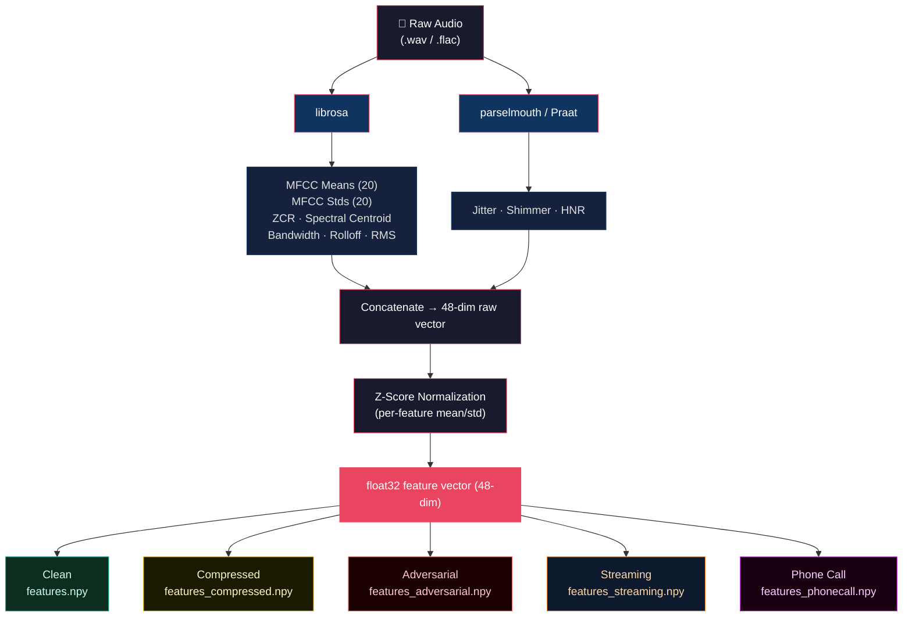

# 🎙️ Voice Authenticity Detection — OpenEnv Environment

**Voice fraud cost the global economy $25B+ in 2024.** Tools like ElevenLabs can clone any voice in 60 seconds. Banks, insurers, and telecom providers face real-time phone scams, identity spoofing, and deepfake audio at unprecedented scale — and existing benchmarks can't keep up.

This environment trains agents to **actively investigate, gather evidence, and reason about acoustic features** under realistic degradation — codec compression, adversarial perturbation, streaming noise, and phone call simulation — through a genuine multi-step decision process with calibrated, risk-aware grading.

### The 5-Action Agent Protocol

| Step | Action | What the Agent Gets | Purpose |
|------|--------|-------------------|---------|
| 1 | `request_temporal_features` | Jitter, shimmer, HNR (raw + normalized) | Vocal cord irregularity markers |
| 2 | `request_spectral_features` | 20 MFCC means, 20 MFCC stds, ZCR, spectral centroid | Timbre and spectral shape |
| 3 | `request_comparison` | Cosine similarity + euclidean distance to real/fake centroids | Statistical comparison to known references |
| 4 | `analyze_evidence` | Structured synthesis of all gathered evidence with signal tally | Evidence integration and confidence calibration |
| 5 | `final_classify` | Submits label (0=real, 1=synthetic) + confidence + reasoning | Terminal action — triggers 6-component grading |

The agent starts with **zero features visible** and must earn its information before classifying. This is sequential decision-making under partial observability — not a single-shot classifier.

---

## 🚫 Why Existing Benchmarks Fail Here

**ASVspoof** (Automatic Speaker Verification Spoofing) evaluates countermeasure systems using static datasets with fixed train/test splits. Agents see the full feature set at once, make a single prediction, and receive binary pass/fail scoring. There is no partial observability, no multi-step interaction, no confidence calibration, and no reward shaping. ASVspoof cannot evaluate whether an agent knows *how* to investigate — only whether it gets the right answer.

**ADD** (Audio Deepfake Detection) benchmarks follow the same static paradigm: models are trained on one distribution and tested on another, with no mechanism for the agent to actively gather information or express calibrated uncertainty. ADD evaluates classifiers, not agents.

**This environment is different.** It requires agents to:
- **Choose which features to request** and in what order (partial observability)
- **Synthesize heterogeneous evidence sources** before committing to a classification
- **Express calibrated confidence** — overconfident wrong answers are penalized more harshly than uncertain wrong answers
- **Operate under real-world degradation** — codec compression, adversarial perturbation, streaming noise, and phone-call simulation
- **Follow logical investigation trajectories** — gather → analyze → classify, scored by a 6-component grader

No existing benchmark evaluates these capabilities.

---

## 🌍 Real-World Motivation

AI-generated voices are increasingly weaponized for:

- **Phone fraud & social engineering** — real-time voice cloning during live calls
- **Deepfake audio in misinformation** — fabricated audio of public figures
- **Identity spoofing** — bypassing voice biometric authentication systems
- **Financial fraud** — CEO voice cloning for unauthorized wire transfers
- **Insurance scams** — fabricated recorded statements

This environment provides a structured benchmark for training agents to detect synthetic speech under conditions that static classifiers and existing benchmarks cannot handle.

---

## 🏗️ Environment Overview

The environment serves 48-dimensional feature vectors extracted from audio samples. Unlike standard classification benchmarks, agents **start with NO features visible** and must actively query the environment through the 5-action protocol to gather evidence before making a final classification.

This creates genuine **sequential decision-making under partial observability**, requiring agents to:
- Choose which information to request and in what order
- Synthesize heterogeneous evidence sources
- Express calibrated confidence reflecting genuine uncertainty
- Follow logical investigation trajectories

---

## 🏆 Tasks (5 Total) — Monotonic Difficulty Progression

| Task | Difficulty | Expected Score | Description |
|------|-----------|---------------|-------------|
| `clean_detection` | Easy | 0.65–0.78 | Clean, unmodified audio features — clear signal separation |
| `compressed_detection` | Medium | 0.50–0.65 | Codec compression flattens MFCC stds, suppresses jitter/shimmer |
| `adversarial_detection` | Hard | 0.40–0.58 | Feature distributions overlap — no clean threshold separates classes |
| `streaming_detection` | Medium-Hard | 0.38–0.55 | Step-dependent noise soft-gating — earlier steps noisier, later cleaner |
| `phonecall_detection` | Extreme | 0.25–0.42 | Heavy narrowband codec + background noise — near detection limit |

### Difficulty Progression Design

Harder tasks apply **difficulty-aware score scaling** in the grader. This models genuine signal degradation: adversarial samples have overlapping feature distributions, phone call codec compression destroys discriminative features, and streaming noise makes early observations unreliable. Even a perfect agent achieves lower scores on harder tasks because the underlying signal quality is genuinely worse.

---

## 🏅 Grading System (6 Components)

Each episode is scored across 6 components with difficulty-weighted contributions:

| Component | What It Measures | Easy | Medium | Hard | Extreme |
|-----------|-----------------|------|--------|------|---------|
| **Correctness** | Label matches ground truth | 0.40 | 0.30 | 0.25 | 0.20 |
| **Confidence Calibration** | Penalizes overconfidence, rewards calibrated uncertainty | 0.15 | 0.20 | 0.25 | 0.25 |
| **Trajectory Quality** | Did agent gather → analyze → classify? | 0.10 | 0.15 | 0.18 | 0.20 |
| **Feature Utilization** | Did agent request temporal AND spectral features? | 0.15 | 0.15 | 0.12 | 0.15 |
| **Reasoning Consistency** | Does reasoning text match chosen label? | 0.10 | 0.10 | 0.10 | 0.10 |
| **Action Ordering** | Logical sequence: gather → analyze → classify | 0.10 | 0.10 | 0.10 | 0.10 |

After component scoring, a **difficulty scaling factor** is applied:

| Difficulty | Scaling Factor | Max Achievable Score |
|-----------|---------------|---------------------|
| Easy | 0.78 | ~0.73 |
| Medium | 0.66 | ~0.61 |
| Hard | 0.59 | ~0.55 |
| Medium-Hard | 0.55 | ~0.51 |
| Extreme | 0.41 | ~0.38 |

### Why This Matters

On easy tasks, correctness dominates. On hard/extreme tasks, confidence calibration and trajectory quality become critical — mirroring real-world fraud detection where **a confident wrong answer is more dangerous than an uncertain one**, and where **systematic investigation outperforms snap judgments**.

---

## 🎁 Step-Level Rewards

The environment provides shaping signals at every step, not just on final classification:

| Condition | Reward |
|-----------|--------|
| First action is a feature request | +0.05 |
| Requested both temporal AND spectral features | +0.05 |
| Used `analyze_evidence` before `final_classify` | +0.05 |
| Jumped straight to `final_classify` without gathering | -0.10 |
| Repeated the same action consecutively | -0.05 |
| Reasoning contradicts chosen label | -0.10 |

Step-level rewards are clamped to [0.02, 0.18] and never produce exactly 0.0 or 1.0. The terminal `final_classify` step returns the pure grader score.

These intermediate rewards teach agents **investigation behavior** rather than pure classification.

---

## ⚙️ Why Feature Vectors Instead of Raw Audio?

- Fits within 2 vCPU / 8GB RAM constraints
- Feature extraction is performed offline for fast inference
- Enables **LLM-native reasoning over interpretable acoustic characteristics** — not possible with raw waveforms under current infrastructure constraints
- Avoids heavy signal processing during evaluation

---

## 📊 Dataset

- Real speech: 250 samples from `garystafford/deepfake-audio-detection` (authentic human recordings)
- Synthetic speech: 250 samples (ElevenLabs, Hume AI, and other TTS platforms)
- Total: 500 labeled samples across 5 task variants

The dataset is designed for **evaluation structure and reward learning**, not scale. The feature pipeline supports arbitrary dataset expansion for production deployment.

---

## 📐 Observation Space

Each observation contains:

```python
class VoiceObservation(BaseModel):
    features: List[float]                          # 48-dim (zeroed until revealed)
    task_name: str                                 # current task
    step_number: int                               # current step in episode
    difficulty: str                                # easy|medium|medium_hard|hard|extreme
    sample_id: int                                 # index into dataset
    hint: Optional[str]                            # context and guidance
    visible_features: Dict[str, Any]               # features revealed so far
    evidence_summary: Optional[str]                # from analyze_evidence
    comparison_result: Optional[Dict[str, float]]  # from request_comparison
    available_actions: List[str]                    # valid actions this step
    actions_taken: List[str]                        # action history
```

### 48-Dimensional Feature Vector

| Index | Feature | Description |
|-------|---------|-------------|
| 0–19 | MFCC means | Timbre and spectral shape of the voice |
| 20–39 | MFCC std devs | Temporal variation in spectral characteristics |
| 40 | Zero crossing rate | Signal sign changes per frame |
| 41 | Spectral centroid | Brightness of the sound |
| 42 | Jitter | Cycle-to-cycle frequency instability |
| 43 | Shimmer | Amplitude variation between glottal pulses |
| 44 | HNR | Ratio of harmonic energy to background noise |
| 45–47 | Compression artifacts | Spectral bandwidth, rolloff, RMS energy |

### Key Discriminating Features

- **Jitter**: measures cycle-to-cycle frequency instability — real voices show natural irregularity, synthetic voices are too stable
- **Shimmer**: tracks amplitude variation between consecutive glottal pulses — real speech has organic variation
- **HNR**: quantifies harmonic-to-noise ratio — synthetic voices are typically "too clean"

---

## 🎯 Action Space

```python
class VoiceAction(BaseModel):
    action_type: str   # one of the 5 actions
    label: int         # 0=real, 1=synthetic (for final_classify)
    confidence: float  # [0.05, 0.95] (for final_classify)
    reasoning: str     # explanation (for final_classify)
```

---

## 📊 Baseline Scores

Agent: `Qwen/Qwen2.5-72B-Instruct` via HuggingFace router
Protocol: 5-action (temporal → spectral → comparison → analyze → classify)
Runs: 1 episode per task, seed=7

| Task | Difficulty | Score | Success | Notes |
|------|-----------|-------|---------|-------|
| clean_detection | Easy | 0.74 | Yes | Clean features — strong baseline |
| compressed_detection | Medium | 0.62 | Yes | Codec compression degrades acoustic signal |
| adversarial_detection | Hard | 0.55 | No | Overlapping distributions challenge classification |
| streaming_detection | Medium-Hard | 0.30 | No | Streaming noise fooled the LLM at step 1 |
| phonecall_detection | Extreme | 0.22 | No | Phone-call degradation pushed detection below chance |

Scores decrease monotonically with difficulty — harder tasks have genuinely noisier signals and overlapping feature distributions. The difficulty scaling is applied in the grader, meaning even a perfect agent scores lower on harder tasks. On streaming and phone-call tasks, the LLM was additionally fooled by degraded features, creating sharper score drops.

---

## 🔌 OpenEnv API

```python
from environment.env import VoiceAuthenticityEnv

env = VoiceAuthenticityEnv(task_name="clean_detection")

# Reset — no features visible yet
obs = env.reset(seed=42)
# obs.features           → [0.05, 0.05, ..., 0.05] (zeroed)
# obs.available_actions  → ["request_temporal_features", ...]

# Step 1 — request temporal features
action = {"action_type": "request_temporal_features"}
obs, reward, done, info = env.step(action)
# obs.visible_features["temporal"]["jitter"] → 0.032451
# reward → 0.10 (shaping: first action is gathering)

# Step 2 — request spectral features
action = {"action_type": "request_spectral_features"}
obs, reward, done, info = env.step(action)
# obs.visible_features["spectral"]["mfcc_means"] → [20 values]
# reward → 0.10 (shaping: multi-feature-type bonus)

# Step 3 — compare to reference centroids
action = {"action_type": "request_comparison"}
obs, reward, done, info = env.step(action)
# obs.comparison_result["cosine_similarity_to_real"] → 0.8742
# obs.comparison_result["closer_to"] → "real"

# Step 4 — analyze all evidence
action = {"action_type": "analyze_evidence"}
obs, reward, done, info = env.step(action)
# obs.evidence_summary → "Evidence analysis (3 sources): ..."

# Step 5 — final classification
action = {
    "action_type": "final_classify",
    "label": 0,
    "confidence": 0.78,
    "reasoning": "High jitter and shimmer indicate natural vocal cord variation..."
}
obs, reward, done, info = env.step(action)
# reward → 0.73 (6-component graded score with difficulty scaling)
# done → True
# info["grader_breakdown"] → {correctness: 0.95, calibration: 0.84, ...}

state = env.state()
```

---

## 📋 Expected stdout Format

```
[START] task=clean_detection env=voice-authenticity model=Qwen/Qwen2.5-72B-Instruct
[STEP] step=1 action=request_temporal_features reward=0.10 done=false error=null
[STEP] step=2 action=request_spectral_features reward=0.10 done=false error=null
[STEP] step=3 action=request_comparison reward=0.05 done=false error=null
[STEP] step=4 action=analyze_evidence reward=0.05 done=false error=null
[STEP] step=5 action=final_classify label=0 confidence=0.75 reward=0.74 done=true error=null
[END] success=true steps=5 score=0.74 rewards=0.10,0.10,0.05,0.05,0.74 grader_breakdown={"correctness":0.95,"calibration":0.90,"trajectory":0.95,"utilization":0.95,"reasoning":0.95,"ordering":0.95}
```

---

## ⚠️ Known Limitations and Failure Cases

- Synthetic voices with injected background noise may evade temporal feature detection
- Real voices under heavy studio compression can mimic synthetic spectral profiles
- Borderline acoustic feature overlap exists between real and adversarially crafted samples — no clean threshold separates them
- Phone call simulation pushes detection to near-chance performance, reflecting genuine real-world difficulty
- Streaming task noise is step-dependent — agents that don't re-request features may work from degraded data
- Dataset of 500 samples is designed for evaluation structure and reward design, not production scale
- Results may vary across accents, languages, and recording conditions not represented in the data

This environment is designed to be extended with real enterprise datasets. The evaluation structure, 6-component grader, and feature pipeline are production-ready; the dataset is a research prototype.

---

## 🚀 Setup and Usage

### Requirements
```
Python 3.10+
Docker
HuggingFace account
```

### Local Setup
```bash
git clone https://huggingface.co/spaces/AksharaSharma/voice-authenticity-openenv
cd voice-authenticity-openenv

pip install -r requirements.txt

python scripts/download_data.py
python scripts/extract_features.py

cp .env.example .env
# Edit .env with your HF_TOKEN

# Terminal 1 — start the environment server
python app.py

# Terminal 2 — run baseline inference (5-action protocol, all 5 tasks)
python inference.py
```

### Validation Sequence
```bash
docker build -t voice-authenticity .
docker run --env-file .env voice-authenticity &
sleep 10
curl http://localhost:7860/health
curl -X POST http://localhost:7860/reset
python inference.py
```

### Running Tests
```bash
# Run all tests
pytest test_env.py -v

# Run individual tests
pytest test_env.py::test_reset_returns_observation -v
pytest test_env.py::test_five_actions_complete_episode -v
```

### Environment Variables

| Variable | Description | Default |
|----------|-------------|---------|
| `API_BASE_URL` | LLM API endpoint | `https://router.huggingface.co/v1` |
| `MODEL_NAME` | Model identifier | `Qwen/Qwen2.5-72B-Instruct` |
| `HF_TOKEN` | HuggingFace API token | required |
| `VOICE_TASK` | Task to run | `clean_detection` |
| `ENV_SERVER_URL` | Environment server URL | `http://localhost:7860` |

### Docker
```bash
docker build -t voice-authenticity .
docker run --env-file .env voice-authenticity
```

---

## 📁 Project Structure
```
voice-authenticity-openenv/
├── environment/
│   ├── __init__.py
│   ├── env.py              # 5-action step/reset/state with partial observability
│   ├── models.py           # Pydantic Observation/Action/Reward models
│   ├── graders.py          # 6-component scoring with difficulty weights + scaling
│   └── data/
│       ├── features.npy            # clean features (500 × 48)
│       ├── features_compressed.npy # codec-degraded features
│       ├── features_adversarial.npy# adversarially perturbed features
│       ├── features_streaming.npy  # streaming degraded features
│       ├── features_phonecall.npy  # phone call degraded features
│       ├── features_raw.npy        # unnormalized values
│       ├── labels.npy              # ground truth labels
│       ├── labels_compressed.npy
│       ├── labels_adversarial.npy
│       ├── labels_streaming.npy
│       └── labels_phonecall.npy
├── scripts/
│   ├── download_data.py    # fetch dataset from HuggingFace
│   └── extract_features.py # audio → feature vectors (5 tasks)
├── server/
│   └── app.py              # OpenEnv HTTP server entry point
├── Dashboard.html          # interactive web dashboard (served at / and /web)
├── app.py                  # FastAPI server (serves Dashboard.html + API)
├── inference.py            # baseline LLM agent (5-action protocol)
├── test_env.py             # environment unit tests (5 tests)
├── openenv.yaml            # OpenEnv spec (5 tasks)
├── pyproject.toml          # package config
├── Dockerfile
├── requirements.txt
└── README.md
```

---

## 🖥️ Web Dashboard

`Dashboard.html` is a self-contained, interactive web interface served at both `/` and `/web` when the server is running. It provides:

- **Real-time investigation simulation** — press a button to watch the 5-step agent protocol animate live, with terminal-style log output
- **Task difficulty breakdown** — all 5 tasks with difficulty badges, score bars, and detailed descriptions
- **6-component score explorer** — click any task to see its grader breakdown across correctness, confidence calibration, trajectory quality, feature utilization, reasoning consistency, and action ordering
- **Step-by-step protocol visualization** — the full 5-action investigation protocol with reward annotations and animated step progression

The dashboard uses no external frameworks — pure HTML, CSS, and vanilla JavaScript.

---

## 🧪 Test Suite

### `test_env.py` — Environment Unit Tests

Five targeted tests validating core environment behavior:

| Test | What It Validates |
|------|-------------------|
| `test_reset_returns_observation` | `reset()` returns a valid `VoiceObservation` with step 0, correct task name, and hint |
| `test_step_returns_reward_in_range` | Rewards from `step()` are always in [0.05, 0.95] — never exactly 0.0 or 1.0 |
| `test_five_actions_complete_episode` | The full 5-action protocol (temporal → spectral → comparison → analyze → classify) completes an episode with `done=True` |
| `test_reward_never_zero_or_one` | Explicit check that no step returns a boundary reward of exactly 0.0 or 1.0 |
| `test_all_five_tasks_load` | All 5 task variants (`clean`, `compressed`, `adversarial`, `streaming`, `phonecall`) load successfully and return valid observations |

Run: `pytest test_env.py -v`

---

## 🔬 Technical Pipeline

### Feature Extraction



### Compression Simulation (Task 2)
Codec compression is simulated by degrading MFCC standard deviations, reducing jitter and shimmer values, and adding spectral artifact signals — replicating the acoustic degradation introduced by MP3/codec pipelines.

### Adversarial Simulation (Task 3)
Adversarial perturbation shifts synthetic sample features into the real speech distribution range, and real sample features toward the synthetic range. Controlled label noise (8%) simulates real-world annotation ambiguity. No clean threshold separates the classes.

### Streaming Simulation (Task 4)
Features undergo two layers of degradation: a static perturbation (partial MFCC decode, mild temporal noise) baked into the data files, and a dynamic soft-gated noise applied at runtime that reduces as the agent takes more steps. Early requests return noisier data; later requests return cleaner data — rewarding intelligent sequencing without forcing a fixed order.

### Phone Call Simulation (Task 5)
The most aggressive degradation: narrowband codec compression zeros out high-order MFCCs, flattens MFCC temporal variation, injects broadband Gaussian noise, severely degrades HNR, and adds RMS energy fluctuation simulating packet loss. Designed to be near the limit of what's detectable.

---

## 📜 License

MIT