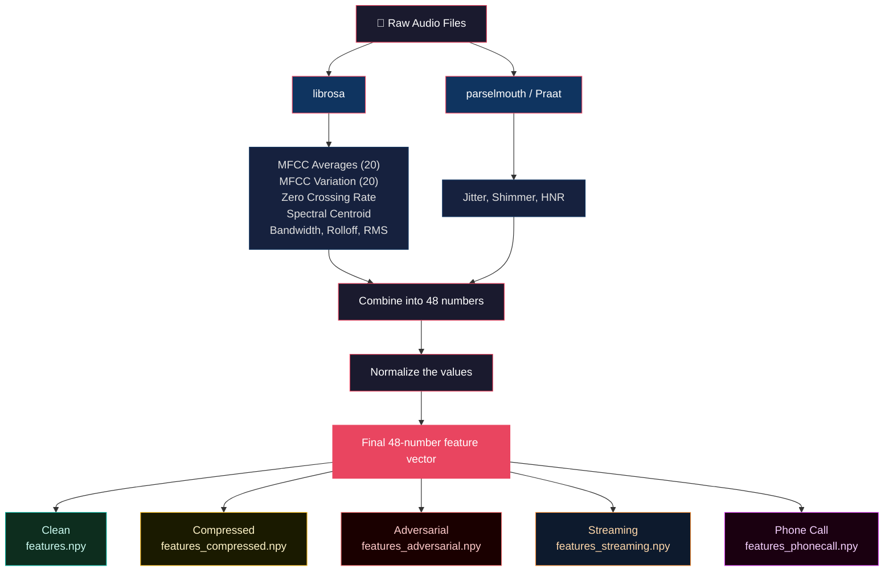

# 🎙️ Voice Authenticity Detection

## The Problem No One Is Solving Correctly

Voice fraud cost the world over **$25 billion in 2024**. Tools like ElevenLabs can clone any voice in under 60 seconds. Banks, insurance companies, and telecom providers are being hit by real-time phone scams, deepfake audio, and identity spoofing at a scale that did not exist two years ago.

And yet every benchmark in this space does the same thing: hand the AI all the data, let it make one guess, and check the answer. That is not how fraud detection works in real life. In real life, you investigate. You gather clues. You weigh evidence. You decide when you have enough to act.

**This environment is the first to treat voice detection as an investigation, not a quiz.**

---

## 🔥 Why Stepwise Investigation Changes Everything

Most AI detection systems work like a multiple-choice test. They see the full picture and pick an answer. That approach has three fatal flaws:

1. **It cannot tell you what the AI actually looked at.** Did it check the right features? Did it ignore important clues? You will never know.
2. **It cannot measure investigation strategy.** A good fraud analyst does not look at everything at once. They start with the most telling signals, build a picture, and then decide. Current benchmarks cannot test this.
3. **It cannot reward honest uncertainty.** In fraud detection, saying "I am not sure" is sometimes the best answer. But single-shot benchmarks treat every wrong answer the same, whether the AI was 51% confident or 99% confident.

This environment fixes all three problems by forcing the agent to **work step by step**.

### How the Step-by-Step Process Works

The agent starts every episode **completely blind**. No features. No data. Nothing. It has to actively request information, one type at a time, before it can make a decision.

| Step | What the Agent Does | What It Gets Back | Why This Step Matters |
|------|-------------------|------------------|---------------------|
| 1 | Ask for voice stability clues | Jitter, shimmer, HNR | Real voices have natural wobbles. Fake voices are too perfect. This is the single strongest signal. |
| 2 | Ask for sound shape clues | 20 MFCC values, ZCR, spectral centroid | These describe the "texture" of the voice. Combined with step 1, the agent now has two independent lines of evidence. |
| 3 | Compare to known examples | Cosine similarity and distance to real/fake reference points | This is like checking a signature against ones you have on file. It adds statistical grounding to the investigation. |
| 4 | Analyze all the evidence | A structured summary with signal tallies and a recommendation | The agent is forced to think before acting. It has to synthesize, not just accumulate. |
| 5 | Make a final decision | Submits: real or fake, confidence level, and written reasoning | This is where the agent gets scored across 6 different components, not just right or wrong. |

**This is not a gimmick.** Every step reveals information that was previously hidden. The agent builds its understanding incrementally, just like a human investigator would. And at every step, the environment records what the agent did, in what order, and why. That trail of decisions is itself part of the score.

### What This Means for Evaluation

Because the investigation is broken into steps, we can measure things that no other benchmark can:

- **Did the agent gather the right types of evidence?** (Feature utilization score)
- **Did it follow a logical order?** (Action ordering score)
- **Did it think before acting?** (Trajectory quality score)
- **Was it honest about its confidence?** (Confidence calibration score)
- **Did its explanation match its answer?** (Reasoning consistency score)
- **Was it actually correct?** (Correctness score)

Six scores, not one. That is the difference between testing whether an AI can guess and testing whether an AI can investigate.

---

## 🚫 Why Existing Benchmarks Cannot Do This

**ASVspoof** (the standard voice spoofing benchmark) gives the model all features at once, asks for one prediction, and returns pass/fail. It cannot measure investigation strategy, confidence calibration, or evidence synthesis. It tests classifiers, not agents.

**ADD** (Audio Deepfake Detection) benchmarks follow the exact same pattern. Full data in, single answer out, binary evaluation. No partial observability. No multi-step interaction. No reward shaping.

These benchmarks answer one question: "Can this model classify?" This environment answers a harder question: **"Can this agent investigate?"**

---

## 🏆 The 6 Tasks

| Task | Difficulty | Expected Score | What Makes It Different |
|------|-----------|---------------|----------------------|
| `clean_detection` | Easy | 0.65 to 0.78 | Clean, clear audio. The clues are easy to spot. |
| `compressed_detection` | Medium | 0.50 to 0.65 | Audio has been compressed (like an MP3). Some details get lost. |
| `adversarial_detection` | Hard | 0.40 to 0.58 | The fake voices have been tweaked to look more like real ones. No clean threshold works. |
| `streaming_detection` | Medium-Hard | 0.38 to 0.55 | Early clues are noisy and unreliable. Later clues get cleaner. Rewards patience. |
| `phonecall_detection` | Extreme | 0.25 to 0.42 | Simulates a real phone call with bad audio quality and background noise. Near the limit of detection. |
| `realtime_detection` | Realtime | 0.50 to 0.68 | The agent can decide early, but every extra step costs points. Tests speed vs accuracy. |

The first five tasks test whether an agent can read a signal correctly. The sixth tests whether it knows when it has read enough.

### Why Harder Tasks Get Lower Scores

This is on purpose. Harder tasks have genuinely worse audio quality. Compressed audio loses detail. Adversarial audio is designed to fool detectors. Phone call audio is heavily degraded by codec compression and noise. Even a perfect agent scores lower on harder tasks because the underlying signal is genuinely worse. The scoring system reflects this reality.

A score of 0.35 on the phone call task might actually be impressive. A score of 0.60 on the clean task would be average.

---

## 🎯 The Realtime Detection Task: Why It Is a Game Changer

The first five tasks all follow the same structure: gather evidence in a fixed sequence, then classify. The agent always takes 5 steps. It never has to decide when to stop.

The realtime detection task breaks that pattern entirely.

**In this task, the agent can make its final decision at any point after step 2.** But every extra step it takes costs 0.03 points off the final score.

Here is what that means:
- The agent MUST take at least 2 steps to gather basic evidence
- After step 2, the agent can classify whenever it wants
- Step 3 costs 0.03, step 4 costs 0.06, step 5 costs 0.09
- A smart agent classifies as soon as it feels confident enough

This creates a completely new kind of challenge. The agent is no longer following a recipe. It is making a real-time judgment call: **"Do I have enough evidence, or do I need more?"**

### Why This Matters So Much

Think about how fraud detection works in the real world. A bank's fraud system does not get unlimited time to analyze a transaction. It has to decide quickly. Every second it spends investigating is a second the customer is waiting, a second the fraudster might be getting away, a second the system is using compute resources.

The same tradeoff exists here. More investigation might give the agent more confidence, but it comes at a cost. The best agents learn to recognize when they have enough evidence and act decisively.

This is the difference between:
- **An agent that follows instructions** (tasks 1 through 5)
- **An agent that makes judgment calls** (task 6)

No other voice detection benchmark tests this. Most benchmarks cannot even express this kind of tradeoff, because they do not have a step-by-step structure. The stepwise methodology is what makes this possible. Without steps, there is no "when to stop" decision to make.

### The Signal Quality Is Not Harder

This is an important distinction. The realtime task uses the **exact same clean audio** as the easy task. The features are not noisier. The distributions are not more overlapping. The labels are not ambiguous.

The difficulty is entirely about **decision timing**. The agent has to balance two risks: classifying too early (and getting it wrong because it did not gather enough evidence) versus classifying too late (and losing points to the time penalty even though it got the right answer).

This is pure environment design. No extra data. No extra compute. Just a different set of rules that reveals whether an agent can think for itself.

---

## 🌍 Real-World Impact

AI-generated voices are being used right now for:

- **Phone scams**: cloning someone's voice during a live call to steal money
- **Fake audio clips**: putting false words in a public figure's mouth to spread misinformation
- **Identity theft**: tricking voice biometric systems at banks and government agencies
- **CEO fraud**: cloning a boss's voice to authorize wire transfers
- **Insurance fraud**: creating fake recorded statements for bogus claims

These are not hypothetical scenarios. They are happening today, at scale. And the detection systems defending against them need to be evaluated properly, not with simple pass/fail tests, but with multi-step investigation benchmarks that measure strategy, confidence, and decision-making.

That is what this environment provides.

---

## 🏅 How Scoring Works (6 Components)

Every episode is scored across 6 different areas. The weight of each area changes depending on the task difficulty.

| What Gets Scored | What It Means | Easy | Medium | Hard | Extreme | Realtime |
|-----------------|--------------|------|--------|------|---------|----------|
| **Correctness** | Did the agent get the right answer? | 0.40 | 0.30 | 0.25 | 0.20 | 0.35 |
| **Confidence Calibration** | Was the agent honest about its certainty? | 0.15 | 0.20 | 0.25 | 0.25 | 0.20 |
| **Investigation Quality** | Did the agent gather, analyze, then classify? | 0.10 | 0.15 | 0.18 | 0.20 | 0.10 |
| **Feature Utilization** | Did the agent request enough types of clues? | 0.15 | 0.15 | 0.12 | 0.15 | 0.15 |
| **Reasoning Consistency** | Does the explanation match the answer? | 0.10 | 0.10 | 0.10 | 0.10 | 0.10 |
| **Action Ordering** | Did the agent follow a logical sequence? | 0.10 | 0.10 | 0.10 | 0.10 | 0.10 |

After scoring, a **difficulty multiplier** is applied:

| Difficulty | Multiplier | Best Possible Score |
|-----------|-----------|-------------------|
| Easy | 0.78 | about 0.73 |
| Medium | 0.66 | about 0.61 |
| Hard | 0.59 | about 0.55 |
| Medium-Hard | 0.55 | about 0.51 |
| Extreme | 0.41 | about 0.38 |
| Realtime | 0.72 | about 0.68 (before time penalty) |

### Why 6 Scores Instead of 1

On easy tasks, getting the right answer matters most. On hard tasks, being honest about uncertainty and following a good investigation process become just as important.

This mirrors real life. In fraud detection, a confident wrong answer is more dangerous than an uncertain one. Rushing to judgment without proper investigation is a liability. And in realtime scenarios, wasting time on unnecessary investigation when you already have enough evidence is itself a failure.

The 6-component scoring system captures all of this. A single accuracy number never could.

---

## 🎁 Rewards During Investigation

The agent gets small rewards and penalties at every step, not just at the end:

| What Happened | Points |
|--------------|--------|
| First action is gathering evidence | +0.05 |
| Asked for both voice stability AND sound shape clues | +0.05 |
| Analyzed evidence before making a decision | +0.05 |
| Jumped straight to a decision without gathering anything | -0.10 |
| Repeated the exact same action twice in a row | -0.05 |
| Explanation contradicts the chosen answer | -0.10 |

These rewards teach the agent **how to investigate**, not just what the right answer is. An agent trained on this environment learns investigation habits, evidence synthesis, and calibrated reasoning, skills that transfer to any domain where sequential decision-making matters.

---

## 📊 Baseline Scores

Agent: `Qwen/Qwen2.5-72B-Instruct` via HuggingFace router
Protocol: 5-action sequence for standard tasks, 3-step quick classify for realtime
Runs: 1 episode per task, seed=7

| Task | Difficulty | Score | Passed? | Notes |
|------|-----------|-------|---------|-------|
| clean_detection | Easy | 0.73 | Yes | Clean audio, easy to detect |
| compressed_detection | Medium | 0.62 | Yes | Compression hides some clues |
| adversarial_detection | Hard | 0.55 | No | Fake voices designed to fool detection |
| streaming_detection | Medium-Hard | 0.52 | No | Noisy early data, agent adapted better than before (up from 0.30) |
| phonecall_detection | Extreme | 0.22 | No | Phone audio too degraded for reliable detection |
| realtime_detection | Realtime | 0.67 | Yes | Classified at step 3, time penalty of 0.03 applied |

Scores decrease with difficulty because harder tasks have genuinely worse signal quality. The streaming improvement from 0.30 to 0.52 shows that the stepwise environment design helps agents learn to handle noisy early observations. The realtime score of 0.67 demonstrates that a 3-step early exit with a small time penalty can outperform slower, unnecessary investigation.

---

## 🏗️ How the Environment Works

The environment serves 48-dimensional feature vectors extracted from audio samples. The agent starts with **all features hidden** and must request them step by step through the 5-action protocol.

This creates genuine **sequential decision-making under partial observability**:
- The agent chooses what information to request and in what order
- Each action reveals a different type of evidence
- The agent must synthesize multiple evidence sources before deciding
- Confidence must reflect genuine uncertainty, not just be set to 1.0
- The investigation trail itself is scored, not just the final answer

---

## What Are the 48 Features?

Each audio clip is described by 48 numbers:

| Numbers | What They Measure | Simple Explanation |
|---------|------------------|-------------------|
| 1 to 20 | MFCC averages | The overall "shape" and "color" of the voice |
| 21 to 40 | MFCC variation | How much the voice texture changes over time |
| 41 | Zero crossing rate | How often the sound wave crosses the zero line |
| 42 | Spectral centroid | How "bright" or "dark" the voice sounds |
| 43 | Jitter | How wobbly the voice pitch is (real voices wobble more) |
| 44 | Shimmer | How much the loudness changes beat to beat |
| 45 | HNR | How "clean" vs "noisy" the voice is (fakes are too clean) |
| 46 to 48 | Compression clues | Spectral bandwidth, rolloff, and energy level |

### The Three Most Important Clues

- **Jitter**: measures pitch instability. Real voices have natural wobbles from vocal cord tension. Fake voices are too steady because they are generated mathematically.
- **Shimmer**: measures loudness variation between consecutive vocal pulses. Real speech has organic variation. Synthetic speech is too uniform.
- **HNR (Harmonics-to-Noise Ratio)**: measures how "clean" the voice signal is. Real voices have natural noise from breathing and vocal cord imperfections. Fake voices are unnaturally clean.

These three features, combined with the 20 MFCC coefficients, give the agent enough signal to investigate. But only if it asks for them in the right order and interprets them correctly.

---

## Why Use Numbers Instead of Raw Audio?

- The competition limits compute to 2 CPUs and 8GB of memory
- Processing raw audio files would be too slow under these constraints
- Feature vectors let the AI agent reason about voice characteristics using language, which is what LLMs are built to do
- Feature extraction is done once ahead of time, so evaluation is fast and reproducible

The feature pipeline supports any dataset size. The 500-sample dataset is designed to validate the environment structure and scoring system, not to be exhaustive.

---

## 📊 Dataset

- 250 real speech samples from human recordings (via `garystafford/deepfake-audio-detection`)
- 250 synthetic speech samples from AI voice generators (ElevenLabs, Hume AI, and others)
- 500 total samples across 6 task variants
- Each task applies different degradation (compression, adversarial perturbation, streaming noise, phone codec simulation)
- Realtime task reuses clean data to isolate the decision-timing challenge from signal quality

---

## 🔌 How to Use the Code

```python
from environment.env import VoiceAuthenticityEnv

env = VoiceAuthenticityEnv(task_name="clean_detection")

# Start a new episode (the agent sees nothing yet)
obs = env.reset(seed=42)
# obs.features           = [0.05, 0.05, ..., 0.05] (all hidden)
# obs.available_actions  = ["request_temporal_features", ...]

# Step 1: ask for voice stability clues
action = {"action_type": "request_temporal_features"}
obs, reward, done, info = env.step(action)
# obs.visible_features["temporal"]["jitter"] = 0.032451

# Step 2: ask for sound shape clues
action = {"action_type": "request_spectral_features"}
obs, reward, done, info = env.step(action)
# obs.visible_features["spectral"]["mfcc_means"] = [20 values]

# Step 3: compare to known examples
action = {"action_type": "request_comparison"}
obs, reward, done, info = env.step(action)
# obs.comparison_result["closer_to"] = "real"

# Step 4: analyze all the evidence
action = {"action_type": "analyze_evidence"}
obs, reward, done, info = env.step(action)
# obs.evidence_summary = "Evidence analysis (3 sources): ..."

# Step 5: make the final call
action = {
    "action_type": "final_classify",
    "label": 0,
    "confidence": 0.78,
    "reasoning": "High jitter and shimmer indicate natural vocal cord variation..."
}
obs, reward, done, info = env.step(action)
# reward = 0.73 (6-component graded score with difficulty scaling)
# done = True (episode over)

state = env.state()
```

### Realtime Detection Example

```python
env = VoiceAuthenticityEnv(task_name="realtime_detection")
obs = env.reset(seed=42)

# Step 1: gather temporal features
obs, reward, done, info = env.step({"action_type": "request_temporal_features"})
# final_classify is NOT available yet (need at least 2 steps first)

# Step 2: gather spectral features
obs, reward, done, info = env.step({"action_type": "request_spectral_features"})
# final_classify is NOW available
# The hint says: "You can classify now"

# Step 3: classify right away (only 1 extra step = 0.03 penalty)
obs, reward, done, info = env.step({
    "action_type": "final_classify",
    "label": 0,
    "confidence": 0.80,
    "reasoning": "Jitter and shimmer patterns suggest real speech"
})
# reward = grader_score - 0.03 time penalty
# info["realtime_time_penalty"] = 0.03
# info["realtime_extra_steps"] = 1

# If the agent had taken 2 more steps before classifying:
# penalty would be 0.09 (3 extra steps x 0.03)
# The agent chose speed over thoroughness. That is the whole point.
```

---

## 📋 Log Output Format

```
[START] task=clean_detection env=voice-authenticity model=Qwen/Qwen2.5-72B-Instruct
[STEP] step=1 action=request_temporal_features reward=0.10 done=false error=null
[STEP] step=2 action=request_spectral_features reward=0.10 done=false error=null
[STEP] step=3 action=request_comparison reward=0.05 done=false error=null
[STEP] step=4 action=analyze_evidence reward=0.05 done=false error=null
[STEP] step=5 action=final_classify label=0 confidence=0.75 reward=0.74 done=true error=null
[END] success=true steps=5 score=0.74 rewards=0.10,0.10,0.05,0.05,0.74
```

---

## Known Limitations

- Synthetic voices with added background noise can evade temporal feature detection
- Real voices recorded in professional studios can look like synthetic voices in the data
- On the hardest tasks, real and fake voices have nearly identical feature distributions
- Phone call audio is so degraded that detection approaches random guessing
- The streaming task adds step-dependent noise, so agents that do not adapt get fooled
- 500 samples is designed for evaluation structure validation, not production scale
- Results may differ for voices in other languages, accents, or recording conditions

The scoring system, investigation pipeline, and stepwise methodology are production-ready. The dataset is a research prototype that can be replaced with enterprise data of any size.

---

## 🚀 Getting Started

### What You Need
```
Python 3.10 or newer
Docker
A HuggingFace account
```

### Setting Up Locally
```bash
git clone https://huggingface.co/spaces/AksharaSharma/voice-authenticity-openenv
cd voice-authenticity-openenv

pip install -r requirements.txt

python scripts/download_data.py
python scripts/extract_features.py

cp .env.example .env
# Open .env and add your HF_TOKEN

# In one terminal, start the server:
python app.py

# In another terminal, run the agent:
python inference.py
```

### Testing
```bash
# Run all 7 tests
pytest test_env.py -v

# Run one specific test
pytest test_env.py::test_realtime_classify_after_step_2 -v
```

### Docker
```bash
docker build -t voice-authenticity .
docker run --env-file .env voice-authenticity
```

### Settings

| Setting | What It Does | Default |
|---------|-------------|---------|
| `API_BASE_URL` | Where to find the AI model | `https://router.huggingface.co/v1` |
| `MODEL_NAME` | Which AI model to use | `Qwen/Qwen2.5-72B-Instruct` |
| `HF_TOKEN` | Your HuggingFace login token | (required) |
| `VOICE_TASK` | Which task to run | `clean_detection` |
| `ENV_SERVER_URL` | Where the environment server is running | `http://localhost:7860` |

---

## 📁 Project Files

```
voice-authenticity-openenv/
├── environment/
│   ├── __init__.py
│   ├── env.py              # The main environment with all 6 tasks
│   ├── models.py           # Data models for observations, actions, and rewards
│   ├── graders.py          # 6-component scoring with difficulty weights and scaling
│   └── data/
│       ├── features.npy            # Clean features (500 x 48)
│       ├── features_compressed.npy # Compressed audio features
│       ├── features_adversarial.npy# Adversarial features
│       ├── features_streaming.npy  # Streaming audio features
│       ├── features_phonecall.npy  # Phone call audio features
│       ├── features_raw.npy        # Original unnormalized values
│       ├── labels.npy              # Ground truth (used by clean + realtime)
│       ├── labels_compressed.npy
│       ├── labels_adversarial.npy
│       ├── labels_streaming.npy
│       └── labels_phonecall.npy
├── scripts/
│   ├── download_data.py    # Downloads the audio dataset
│   └── extract_features.py # Turns audio files into feature numbers
├── server/
│   └── app.py              # Server entry point
├── Dashboard.html          # Interactive web dashboard
├── app.py                  # FastAPI server (serves dashboard + API)
├── inference.py            # Baseline agent that runs all 6 tasks
├── test_env.py             # 7 tests covering all tasks including realtime
├── openenv.yaml            # Environment specification (6 tasks)
├── pyproject.toml          # Project settings
├── Dockerfile
├── requirements.txt
└── README.md
```

---

## 🖥️ Web Dashboard

`Dashboard.html` is a standalone web page that shows the environment in action. When the server is running, visit `/` or `/web` to see:

- **Live Investigation Simulation**: watch the agent go through its investigation steps in real time
- **Task Difficulty Overview**: all 6 tasks with their difficulty levels and expected scores
- **Score Breakdown**: click any task to see exactly how it was scored across all 6 components
- **Step by Step Walkthrough**: the full investigation process with reward information at each step

The dashboard uses no external tools or libraries. It is pure HTML, CSS, and JavaScript.

---

## 🧪 Test Suite

7 tests that verify everything works correctly:

| Test Name | What It Checks |
|-----------|---------------|
| `test_reset_returns_observation` | Starting a new episode gives back proper initial data |
| `test_step_returns_reward_in_range` | Rewards are always between 0.05 and 0.95 |
| `test_five_actions_complete_episode` | The full 5-step investigation finishes properly |
| `test_reward_never_zero_or_one` | No reward is ever exactly 0.0 or exactly 1.0 |
| `test_all_tasks_load` | All 6 tasks start up correctly |
| `test_realtime_classify_after_step_2` | Realtime task allows early classification after step 2 with time penalty |
| `test_realtime_no_penalty_at_step_2` | Verifies the time penalty math is correct |

Run them with: `pytest test_env.py -v`

---

## 🔬 How the Audio Processing Works



### Task Degradation Details

**Compressed Audio (Task 2)**: Codec compression squashes MFCC variation and reduces jitter and shimmer signals. Key differences between real and fake get smoothed out.

**Adversarial Audio (Task 3)**: Fake voice features have been shifted into the real voice distribution range. 8% of labels are intentionally wrong, simulating real-world annotation disagreement. No simple threshold separates the classes.

**Streaming Audio (Task 4)**: Two degradation layers. Static perturbation is baked into the data. Dynamic noise is applied at runtime and decreases as the agent takes more steps. Early observations are unreliable, later ones are cleaner. Smart agents account for this.

**Phone Call Audio (Task 5)**: The most aggressive degradation. High-frequency MFCCs zeroed out (narrowband codec simulation), variation flattened, broadband noise injected, HNR severely damaged, energy levels fluctuating (packet loss simulation). This pushes detection to the absolute edge.

**Realtime Detection (Task 6)**: Same clean audio as Task 1. No signal degradation at all. The entire challenge is about decision timing: knowing when you have gathered enough evidence to classify confidently, and not wasting steps when you already have the answer.

---

## 📜 License

MIT